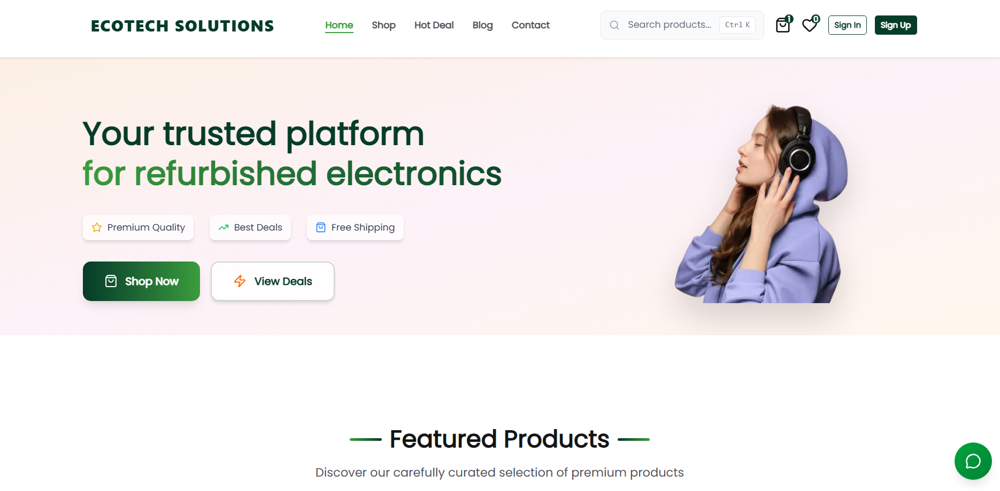

# EcoTech Solutions - E-commerce Platform

A modern, full-stack e-commerce platform for refurbished electronics, built for EcoTech Solutions. This application provides a seamless shopping experience with secure authentication, real-time payments, and robust content management. 


 
## 🚀 Features

-   **User Authentication**: Secure sign-up/sign-in and user management powered by Clerk.
-   **Content Management**: Flexible product and content management using Sanity CMS.
-   **Website Payments**: Secure payment processing with Stripe.
-   **Email Notifications**: Transactional emails (order confirmations, etc.) via Resend.
-   **Responsive Design**: Mobile-friendly interface built with Next.js and Tailwind CSS.
-   **Admin Dashboard**: Manage orders, products, and view analytics.

---

## 🛠️ Tech Stack

-   **Framework**: [Next.js 16](https://nextjs.org/) (App Router)
-   **Language**: TypeScript
-   **Styling**: Tailwind CSS, Shadcn/ui
-   **Database/CMS**: [Sanity](https://www.sanity.io/) 
-   **Authentication**: [Clerk](https://clerk.com/) 
-   **Website Payments**: [Stripe](https://stripe.com/) 
-   **Email Notifications**: [Resend](https://resend.com/) 
-   **AI Chatbot**: [Google Gemini](https://aistudio.google.com/welcome) 
--- 

## 🏁 Getting Started

### Prerequisites 

Before you begin, ensure you have the following installed:

-   Node.js 18 or later [Download](https://nodejs.org/en/download/)
-   npm, yarn, or bun 
-   Git [Download](https://git-scm.com/)

---

## 📋 Step-by-Step Setup

### 1️⃣ Clone the Repository

```bash
git clone https://github.com/MichaelKamau007/CSC-4158B-Computer-Science-Project-Implementation.git
cd shopcartpro-yt
```

### 2️⃣ Install Dependencies

Choose your preferred package manager:

```bash 
# Using npm (Recommended)
npm install

# Using yarn
yarn install

# Using pnpm 
pnpm install
```

### 3️⃣ Set Up Environment Variables
Create a `.env` file in the root directory.
Copy the contents from `.env.example` to your `.env` file:

```bash
# Base URL
NEXT_PUBLIC_BASE_URL=http://localhost:3000


# Sanity CMS Configuration
NEXT_PUBLIC_SANITY_PROJECT_ID=your_sanity_project_id
NEXT_PUBLIC_SANITY_DATASET=your_sanity_dataset
NEXT_PUBLIC_SANITY_API_VERSION=2025-11-21
SANITY_API_TOKEN=your_sanity_api_token
SANITY_API_READ_TOKEN=your_sanity_read_token


# Clerk URL Configuration 
NEXT_PUBLIC_CLERK_SIGN_IN_URL=/sign-in
NEXT_PUBLIC_CLERK_SIGN_UP_URL=/sign-up
NEXT_PUBLIC_CLERK_AFTER_SIGN_IN_URL=/user/dashboard
NEXT_PUBLIC_CLERK_AFTER_SIGN_UP_URL=/user/dashboard
NEXT_PUBLIC_CLERK_SIGN_IN_FALLBACK_REDIRECT_URL=/user/dashboard
NEXT_PUBLIC_CLERK_SIGN_UP_FALLBACK_REDIRECT_URL=/user/dashboard
NEXT_PUBLIC_CLERK_SIGN_IN_FORCE_REDIRECT_URL=/user/dashboard
NEXT_PUBLIC_CLERK_SIGN_UP_FORCE_REDIRECT_URL=/user/dashboard
NEXT_PUBLIC_CLERK_PUBLISHABLE_KEY=your_clerk_publishable_key
CLERK_SECRET_KEY=your_clerk_secret_key


# Stripe Payment Gateway
NEXT_PUBLIC_STRIPE_PUBLISHABLE_KEY=your_stripe_publishable_key
STRIPE_SECRET_KEY=your_stripe_secret_key
STRIPE_WEBHOOK_SECRET=your_stripe_webhook_secret


# Contact Information
NEXT_PUBLIC_COMPANY_NAME=EcoTech Solutions
NEXT_PUBLIC_COMPANY_EMAIL=support@ecotech.org
NEXT_PUBLIC_COMPANY_PHONE=+254712345678
NEXT_PUBLIC_COMPANY_ADDRESS=123 Shopping Street
NEXT_PUBLIC_COMPANY_CITY=Nairobi, Kenya
NEXT_PUBLIC_COMPANY_BUSINESS_HOURS_WEEKDAY=Monday - Friday: 9AM - 7PM
NEXT_PUBLIC_COMPANY_BUSINESS_HOURS_WEEKEND=Saturday: 10AM - 4PM
NEXT_PUBLIC_SUPPORT_EMAIL=support@ecotech.com 
NEXT_PUBLIC_SALES_EMAIL=sales@ecotech.org
NEXT_PUBLIC_CONTACT_RESPONSE_TIME=We reply within 24 hours
NEXT_PUBLIC_QUICK_RESPONSE_TIME=2-4 hours during business hours


# Social Media Links (Optional)
NEXT_PUBLIC_FACEBOOK_URL=https://www.facebook.com/
NEXT_PUBLIC_TWITTER_URL=https://x.com/
NEXT_PUBLIC_INSTAGRAM_URL=https://www.instagram.com/


# Additional Settings
NEXT_PUBLIC_COMPANY_DESCRIPTION=Discover a variety of electronics at Ecotech, blending quality and affordability to elevate your daily experience.
NEXT_PUBLIC_COPYRIGHT_TEXT=© 2025 EcoTech Solutions. All rights reserved.
NEXT_PUBLIC_PRIVACY_POLICY_URL=/privacy
NEXT_PUBLIC_TERMS_URL=/terms


# Admin setup
NEXT_PUBLIC_ADMIN_EMAIL=[] # Use any email address here to access admin privileges.
TAX_AMOUNT=0.00


# Reward Points Configuration
REWARD_POINTS_THRESHOLD=3000
REWARD_POINTS_AMOUNT=5

# Loyalty Points Configuration  
LOYALTY_POINTS_ORDER_THRESHOLD=5
LOYALTY_POINTS_AMOUNT=100


# Email Service Configuration (Resend)
RESEND_API_KEY=your_resend_api_key


# Google Gemini AI Configuration for Chatbot
GEMINI_API_KEY=your_gemini_api_key
GEMINI_MODEL=gemini-flash-latest
CHATBOT_MAX_HISTORY=10 

# Node Environment
NODE_ENV = "development"
# Run webhook listener locally using the command below:
# stripe listen --forward-to localhost:3000/api/webhook
```

## 🔑 Where to Get Your Credentials

### 🎨 Sanity CMS

1. Visit [Sanity.io](https://www.sanity.io/)
2. Create a free account or sign in
3. Create a new project:
   ```bash
   npm create sanity@latest -- --template clean --create-project "My Sanity Project" --dataset production --typescript 
   ```
4. Get your credentials:
   - Go to [Sanity Management](https://www.sanity.io/manage)
   - Select your project
   - Navigate to **API** section
   - **Project ID**: Copy from project settings
   - **API Tokens**: Click "Add API token"
     - Create token with **Editor** role for `SANITY_API_TOKEN`
     - Create token with **Viewer** role for `SANITY_API_READ_TOKEN`

📚 [Sanity Documentation](https://www.sanity.io/docs)

---

### 🔐 Clerk Authentication

1. Visit [Clerk.com](https://clerk.com/)
2. Sign up for a free account
3. Create a new application
4. Get your credentials from the **API Keys** section:

   - **Publishable Key** → `NEXT_PUBLIC_CLERK_PUBLISHABLE_KEY`
   - **Secret Key** → `CLERK_SECRET_KEY`

5. **Configure Clerk:**
   - Go to **User & Authentication** → **Email, Phone, Username**
   - Enable **Email** authentication
   - Go to **Paths** and set:
     - Sign-in URL: `/sign-in`
     - Sign-up URL: `/sign-up`
     - After sign-in URL: `/user/dashboard`
     - After sign-up URL: `/user/dashboard`

📚 [Clerk Documentation](https://clerk.com/docs)

---

### 💳 Stripe Payment Gateway

1. Visit [Stripe.com](https://stripe.com/)
2. Create a free account
3. Get your credentials from the **Developers** section:

   - Go to **API Keys**
   - **Publishable Key** → `NEXT_PUBLIC_STRIPE_PUBLISHABLE_KEY`
   - **Secret Key** → `STRIPE_SECRET_KEY`

4. **Set up Webhooks:**

   - Go to **Developers** → **Webhooks**
   - Click **Add endpoint**
   - Endpoint URL: `http://localhost:3000/api/webhooks/stripe` (for local testing)
   - Select events: `checkout.session.completed`, `payment_intent.succeeded`
   - Get **Webhook Secret** → `STRIPE_WEBHOOK_SECRET`

5. **Testing in Development:**
   - Install Stripe CLI: [Stripe CLI Installation](https://stripe.com/docs/stripe-cli)
   - Run: `stripe listen --forward-to localhost:3000/api/webhooks/stripe`

📚 [Stripe Documentation](https://stripe.com/docs)

---

### 🔥 Google Gemini AI (for Chatbot)

1. Visit [Google AI Studio](https://aistudio.google.com/welcome)
2. Create a free account
3. Get your credentials from the **API Keys** section:

   - **API Key** → `GEMINI_API_KEY`

📚 [Google Gemini Documentation](https://ai.google.dev/gemini-api/docs)

--- 

### 📧 Email Configuration (Resend)

1. Visit [Resend](https://resend.com/)
2. Create a free account
3. Get your credentials from the **API Keys** section:

   - **API Key** → `RESEND_API_KEY`

📚 [Resend Documentation](https://resend.com/docs/introduction)

---

## 🏃‍♂️ Running the Application

### Development Mode

Start the development server with Turbopack (faster):

```bash
# Using npm
npm run dev

# Using yarn
yarn dev

# Using pnpm
pnpm dev
```

The application will be available at:

- **Frontend**: [http://localhost:3000](http://localhost:3000)
- **Sanity Studio**: [http://localhost:3000/studio](http://localhost:3000/studio)

---

## 🎨 Accessing Different Sections

### 🏠 Customer Frontend

- URL: [http://localhost:3000](http://localhost:3000)
- Features: Browse products, add to cart, checkout, order tracking

### 👨‍💼 Admin Panel

- URL: [http://localhost:3000/admin](http://localhost:3000/admin)
- **Default Access**: Set your email in `NEXT_PUBLIC_ADMIN_EMAIL`
- Features: Manage products, orders, users, notifications

### 🎨 Sanity Studio (CMS)

- URL: [http://localhost:3000/studio](http://localhost:3000/studio)
- Features: Content management, product creation, image uploads


## 🛠️ Available Scripts

```bash
# Development with Turbopack
npm run dev

# Run ESLint
npm run lint

# Generate Sanity TypeScript types
npm run typegen
```

---

## 🔧 Configuration

### Setting Up Admin Access

1. Open `.env` file
2. Set your email as admin:
   ```bash
   NEXT_PUBLIC_ADMIN_EMAIL=youremail@example.com
   ```
3. Sign in to the application with this email
4. Access admin panel at `/admin`


### Customizing Company Information

Update the company information in `.env`:

```bash
NEXT_PUBLIC_COMPANY_NAME=Your Company Name
NEXT_PUBLIC_COMPANY_EMAIL=support@yourcompany.com
NEXT_PUBLIC_COMPANY_PHONE=+1 (555) 123-4567
NEXT_PUBLIC_COMPANY_ADDRESS=Your Business Address
NEXT_PUBLIC_COMPANY_CITY=Your City, State ZIP
```

---

## 📦 Importing Sample Data (Optional)

If you have sample data to populate your store:

```bash
# Import data to Sanity
npx sanity@latest dataset import seed.tar.gz
```

---

## 🎯 Key Technologies
| Technology        | Version  | Purpose          | Documentation                                |
| ----------------- | -------- | ---------------- | -------------------------------------------- |
| **Next.js**       | 16.0.1   | React framework  | [Docs](https://nextjs.org/docs)              |
| **React**         | 19.1.1   | UI library       | [Docs](https://react.dev/)                   |
| **TypeScript**    | 5.7.3    | Type safety      | [Docs](https://www.typescriptlang.org/docs/) |
| **Tailwind CSS**  | 4.1.16   | Styling          | [Docs](https://tailwindcss.com/docs)         |
| **Sanity**        | 4.12.0   | CMS              | [Docs](https://www.sanity.io/docs)           |
| **Clerk**         | 6.34.1   | Authentication   | [Docs](https://clerk.com/docs)               |
| **Stripe**        | 19.2.0   | Payments         | [Docs](https://stripe.com/docs)              |
| **Framer Motion** | 12.23.19 | Animations       | [Docs](https://www.framer.com/motion/)       |
| **Zustand**       | 5.0.8    | State management | [Docs](https://zustand-demo.pmnd.rs/)        |
| **Google Gemini** | 0.24.1   | Chatbot          | [Docs](https://gemini.google.dev/gemini-api/docs)|
| **Resend**        | 6.5.2   | Email service    | [Docs](https://resend.com/docs/introduction)|

---

## 🐛 Troubleshooting

### Common Issues

**1. Sanity Studio not loading**

```bash
# Regenerate Sanity types
npm run typegen
```

**2. Stripe webhook not working locally**

```bash
# Install Stripe CLI and forward webhooks
stripe listen --forward-to localhost:3000/api/webhooks/stripe
```

**3. Clerk authentication errors**

- Verify your Clerk keys are correct
- Check that redirect URLs match your configuration
- Ensure your domain is added in Clerk dashboard

**4. Environment variables not loading**

- Restart the development server after changing `.env`
- Make sure variable names are correct (no typos)
- Check that sensitive variables don't have quotes

---

## 📄 License

This project is proprietary software developed for EcoTech Solutions.

